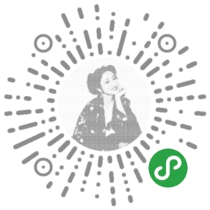

字符画生成
====
项目介绍
--------
* 本项目是小程序 `字符画生成` 的后台，项目主要是能将图片和动图转为由字符串组成的图片，项目采用 `spring boot` 开发
* 项目起步是参考 [ascimg](https://github.com/korhner/asciimg) ,在其基础上增加了彩色字符画的生成，并部署上线

项目部署
---------
* 项目使用 `gradle` 来做包管理，下载后使用 `gradle install` 或使用 `IntelliJ IDEA`导入后即可安装所需jar包
* 由于保密需要， `application.properties` 中缺少小程序的 `appID` 和 `appSecret`，只需在自己的小程序平台中获取即可，或直接改为部署在网页端 

图像处理算法简介
----
* 将图片根据输入的字体大小和要使用的字符生成各个字符的矩形块缓存
* 根据缓存块中尺寸最大的正方形的尺寸来分块，并切除边界不足一个最小矩形的区域
* 对每一个分块使用 [ssim](https://zh.wikipedia.org/wiki/結構相似性) 算法来比对得到每一个矩形块分别与哪个字符最匹配
* 若需生成彩色图则还需要得到每一个矩形块的平均颜色，作为该格子绘制字符的画笔颜色

 

小程序使用
-----

[网页版使用](http://asciiimage.szulikebo.top)

